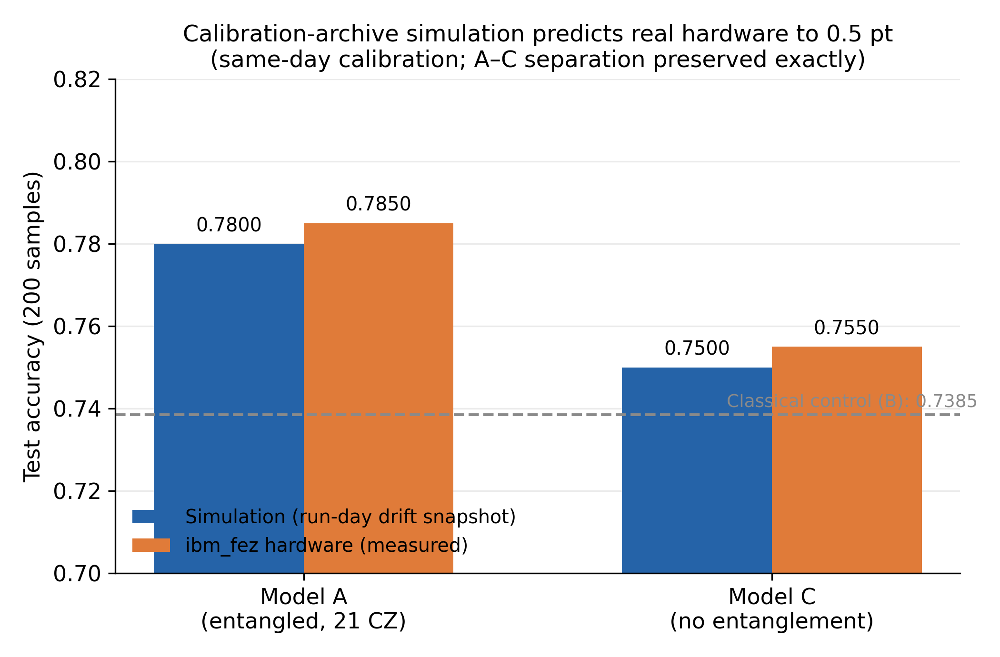
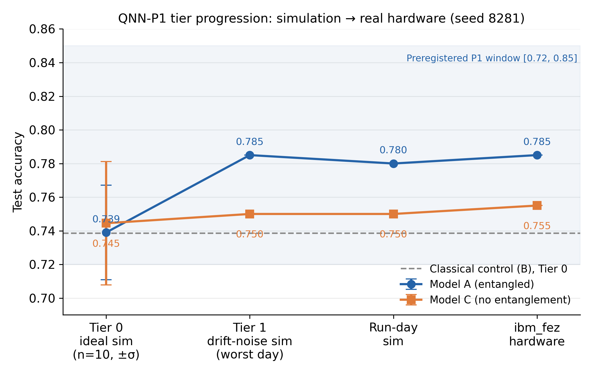
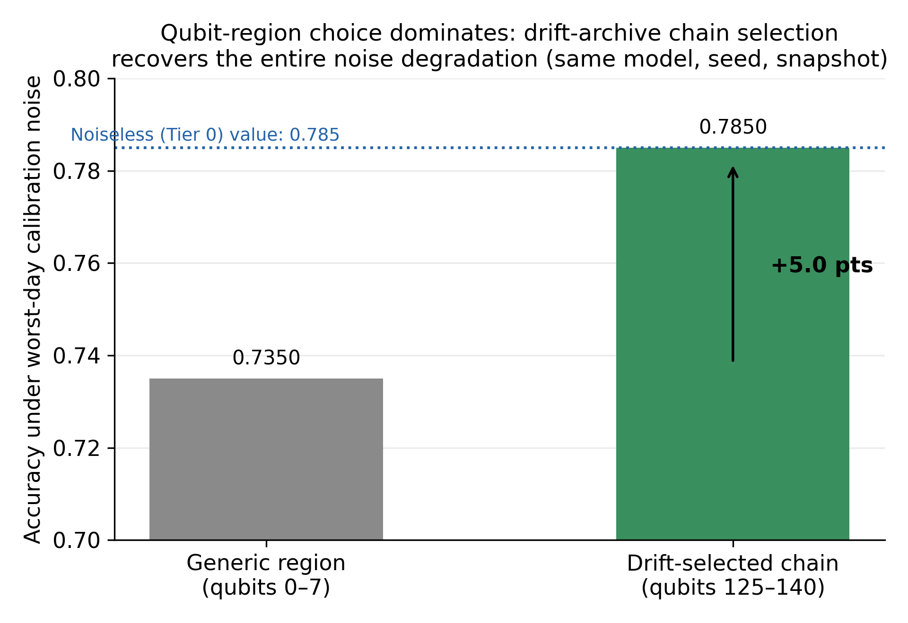

# QNN-P1: Drift-Archive Noise Models Predict Real Quantum Hardware

A preregistered study testing whether a noise model built from a
self-collected, month-long QPU calibration archive (hourly snapshots from a
Raspberry Pi 5 collector) can predict the behavior of a hybrid quantum
neural network on real IBM hardware. It can — to half a point.

## Headline results (all preregistered; see PREREGISTRATION.md)

| Endpoint | Criterion | Result |
|---|---|---|
| P1 | Hardware A in [0.72, 0.85]; vs classical B = 0.7385 | 0.7850 — passed; +4.7 pts over classical |
| P2 | Hardware A-C separation <= 0.05 | 0.030 — passed, matching sim prediction |
| P3 | Sim-to-hardware gap (run-day calibration) | A: +0.5 pt, C: +0.5 pt |

## Full results (seed 8281 unless noted)

| Stage | Model A (entangled) | Model C (no entangle) | Model B (classical) |
|---|---|---|---|
| Tier 0 ideal sim (n=10, mean±σ) | 0.739 ± 0.028 | 0.745 ± 0.037 | 0.739 ± 0.053 |
| Tier 1 sim — worst day (chain) | 0.7850 | 0.7550 | — (noise-free) |
| Tier 1 sim — best day (chain) | 0.7700 | — | — |
| Run-day sim (Jul 19 calibration) | 0.7800 | 0.7500 | — |
| **ibm_fez hardware (measured)** | **0.7850** | **0.7550** | — |

Model B (classical control) is noise-free by construction, so its Tier 0
value carries across all tiers. Tier 0 is the only multi-seed cell (n=10);
hardware cells are single runs (measurement noise ~1 pt on 200 samples).
The A–C separation is 3.0 pts in simulation and 3.0 pts on hardware — the
structure transferred, not just the magnitudes.

## Two additional findings

**Chain selection dominates noise.** Same model, seed, and calibration
snapshot: 0.7350 on a generic qubit region (0-7) vs 0.7850 on the
drift-selected chain (125-140). Chain selection from the archive recovered
the entire noise degradation — a +5.0-pt controlled, single-variable effect.

**Calibration timing is null on a good chain.** An 89% spread in
chain-region composite error across the archive produced only a 1.5-pt
inverted accuracy difference. Where you sit on the lattice matters; when
you run does not, once the chain is well-chosen.

## Method in one paragraph

A 3-arm ablation (A: 8-qubit entangled VQC hybrid; B: parameter-matched
classical MLP; C: entanglement-free hybrid) trained on a quantum-generated
labeling task, evaluated across three tiers: ideal simulation (10 seeds
per arm), drift-seeded noisy simulation (Aer noise models built from
archived ibm_fez calibration snapshots, remapped onto the selected physical
chain), and real ibm_fez hardware via a single-job EstimatorV2 evaluation.
The qubit chain was selected by scoring all 950 8-qubit heavy-hex paths
against 20 daily snapshots; the winner transpiles with zero SWAP insertion
(depth 21, 21 CZ). Comparisons are paired by seed; the null Tier 0 result
(all three arms tie) is what makes the noise-response tiers interpretable.

## Honest failure log

This study kept a live deviations log (see PREREGISTRATION.md). Notable:
hardware cost was initially misestimated by an order of magnitude, two
hardware runs were incorrectly cancelled based on a stale quota warning and
a flawed cost model, and shot count was amended 4096 -> 1024 after committed
reevals demonstrated precision saturation. All deviations were logged
before unblinding any result. The failures are part of the record because
methods that only report successes are not methods.

## Reproduce

See REPRODUCE.md. Tier 0 reproduces on any machine in ~5 minutes with no
IBM account.

## Part of the IRMB program

This study shares infrastructure and methodology with the IRMB
quantum-causality line:

- IRMB Phase 7G Design 5 — Quantum Causality:
  https://github.com/billyrdavis1985-bot/IRMB_Phase7G_Design5_QuantumCausality
- IRMB Design 5 — Multi-Agent Dataset Build:
  https://github.com/billyrdavis1985-bot/IRMB_Design5_Dataset_MultiAgent_Build

The QPU Drift Collector (Raspberry Pi 5, hourly ibm_fez / ibm_marrakesh
calibration telemetry) that made the noise models and chain selection
possible runs continuously as IRMB infrastructure.

## License

MIT (code). Independent Research in Multi-agent Benchmarking (IRMB),
Hudson Forge Technologies LLC — self-funded.
